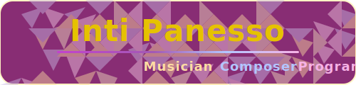

# Hi there, I'm 👋

## 📍 Pasto, Colombia

Welcome to my GitHub profile. I'm a software engineering student passionate about data science and AI development, especially exploring their intersection with the arts.

## Learning

 I undertook undergraduate studies in Music, specializing in performance and composition, and completed a significant portion of the curriculum before redirecting my academic focus toward Software Engineering.

## Professional development
+ 
+ 

## Social Media

  
intipanessochavez@gmail.com